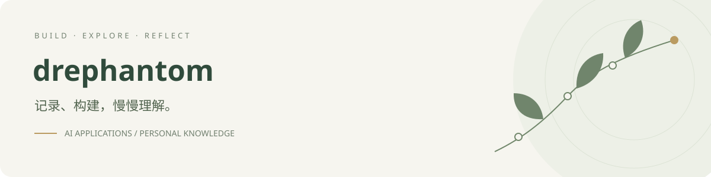

  

# Hi, I'm drephantom

我在探索 AI 应用、个人知识管理，以及如何让模型的回答有据可查。

通过具体项目，持续学习检索、工具调用和应用开发。

[正在构建](#正在构建) · [我关注的实践](#我关注的实践)

## 正在构建

### [Memory Garden · 知微](https://github.com/drephantom/memory-garden)

属于你的，慢慢生长的记忆花园。

一个在本机运行的个人记忆助手：沿着自己的记录，回看想法如何延续与改变，并打开原文核对。

*截图使用示例笔记，不含私人记录。自然对话需要连接生成模型。*

[查看项目 →](https://github.com/drephantom/memory-garden) · [体验示例](https://github.com/drephantom/memory-garden#开始使用) · [了解工作原理](https://github.com/drephantom/memory-garden#agent-如何工作)

## 我关注的实践

- **有来源的回答**：让解释能够回到原始材料，保留尚未确定的部分。
- **可修正的记忆**：让用户能够补充、否认或撤回助手的理解。
- **清晰的数据边界**：区分本地记录与模型服务调用，明确数据去向。

---

从具体的问题开始，让每一次构建留下可以回看的记录。
